# Luxe Hair Studio - Entity Relationship Diagram

## Database Overview
The salon application uses a hybrid database approach:
- **MySQL/SQLite** for core relational data (Users, Bookings, Customers, Admins)
- **MongoDB** for document-based data (Services, Deals)

## Entity Relationship Diagram

```mermaid
erDiagram
    %% Core User Management
    USERS {
        bigint id PK
        string name
        string email UK
        timestamp email_verified_at
        string password
        string role
        string remember_token
        bigint current_team_id FK
        string profile_photo_path
        timestamp created_at
        timestamp updated_at
    }

    %% Booking System
    BOOKINGS {
        bigint id PK
        bigint customer_id FK "nullable"
        string customer_first_name
        string customer_last_name
        string customer_email
        string customer_phone
        string service_id "MongoDB ObjectId"
        string service_name
        decimal service_price
        date booking_date
        time booking_time
        int duration_minutes
        decimal total_price
        text special_requests
        enum status "pending|confirmed|in-progress|completed|cancelled"
        text admin_notes
        bigint staff_id FK "nullable"
        timestamp created_at
        timestamp updated_at
    }

    %% Legacy Customer Model (separate from Users)
    CUSTOMERS {
        int CustomerID PK
        string CustomerName
        string Email
        string Password
        string PhoneNumber
        timestamp email_verified_at
        string remember_token
        timestamp created_at
        timestamp updated_at
    }

    %% Admin Model (separate from Users)
    ADMINS {
        int AdminID PK
        string AdminName
        string Email
        string Password
        string Role
        string ContactNumber
        string remember_token
        timestamp created_at
        timestamp updated_at
    }

    %% MongoDB Services Collection
    SERVICES {
        ObjectId _id PK
        string name
        string slug
        string category
        text description
        float base_price
        string image
        array durations
        array tags
        boolean active
        array staff_ids
        array addon_ids
        string visibility
        float rating
        array booking_constraints
        timestamp deleted_at
        timestamp created_at
        timestamp updated_at
    }

    %% MongoDB Deals Collection
    DEALS {
        ObjectId _id PK
        string DealName
        text Description
        decimal DiscountPercentage
        date StartDate
        date EndDate
        boolean IsActive
        string ServiceID FK
        text Terms
        int MaxUses
        int CurrentUses
        timestamp created_at
        timestamp updated_at
    }

    %% Jetstream Tables
    TEAMS {
        bigint id PK
        bigint user_id FK
        string name
        boolean personal_team
        timestamp created_at
        timestamp updated_at
    }

    TEAM_USER {
        bigint id PK
        bigint team_id FK
        bigint user_id FK
        string role
        timestamp created_at
        timestamp updated_at
    }

    TEAM_INVITATIONS {
        bigint id PK
        bigint team_id FK
        string email
        string role
        timestamp created_at
        timestamp updated_at
    }

    %% Many-to-Many Relationship Tables
    CUSTOMER_SERVICE {
        bigint id PK
        int CustomerID FK
        string ServiceID FK "MongoDB ObjectId"
        string Status
        timestamp BookingDate
        text Notes
        timestamp created_at
        timestamp updated_at
    }

    ADMIN_CUSTOMER {
        bigint id PK
        int AdminID FK
        int CustomerID FK
        timestamp created_at
        timestamp updated_at
    }

    ADMIN_SERVICE {
        bigint id PK
        int AdminID FK
        string ServiceID FK "MongoDB ObjectId"
        timestamp created_at
        timestamp updated_at
    }

    ADMIN_DEAL {
        bigint id PK
        int AdminID FK
        string DealID FK "MongoDB ObjectId"
        timestamp created_at
        timestamp updated_at
    }

    %% Session and Security Tables
    SESSIONS {
        string id PK
        bigint user_id FK
        string ip_address
        text user_agent
        text payload
        int last_activity
    }

    PERSONAL_ACCESS_TOKENS {
        bigint id PK
        string tokenable_type
        bigint tokenable_id
        string name
        string token UK
        text abilities
        timestamp last_used_at
        timestamp expires_at
        timestamp created_at
        timestamp updated_at
    }

    PASSWORD_RESET_TOKENS {
        string email PK
        string token
        timestamp created_at
    }

    CACHE {
        string key PK
        text value
        int expiration
    }

    JOBS {
        bigint id PK
        string queue
        text payload
        int attempts
        int reserved_at
        int available_at
        timestamp created_at
    }

    %% Relationships
    USERS ||--o{ BOOKINGS : "customer_id"
    USERS ||--o{ BOOKINGS : "staff_id"
    USERS ||--o{ TEAMS : "user_id"
    USERS ||--o{ SESSIONS : "user_id"
    USERS ||--o{ PERSONAL_ACCESS_TOKENS : "tokenable_id"

    TEAMS ||--o{ TEAM_USER : "team_id"
    TEAMS ||--o{ TEAM_INVITATIONS : "team_id"
    USERS ||--o{ TEAM_USER : "user_id"

    CUSTOMERS ||--o{ CUSTOMER_SERVICE : "CustomerID"
    SERVICES ||--o{ CUSTOMER_SERVICE : "ServiceID"

    ADMINS ||--o{ ADMIN_CUSTOMER : "AdminID"
    CUSTOMERS ||--o{ ADMIN_CUSTOMER : "CustomerID"

    ADMINS ||--o{ ADMIN_SERVICE : "AdminID"
    SERVICES ||--o{ ADMIN_SERVICE : "ServiceID"

    ADMINS ||--o{ ADMIN_DEAL : "AdminID"
    DEALS ||--o{ ADMIN_DEAL : "DealID"

    SERVICES ||--o{ DEALS : "ServiceID"
    SERVICES ||--o{ BOOKINGS : "service_id"
```

## Key Relationships

### 1. User Management
- **USERS** table serves as the main authentication table with role-based access
- Supports roles: `admin`, `staff`, `customer`
- Integrates with Laravel Jetstream for team management

### 2. Booking System
- **BOOKINGS** table is the central transaction table
- Links to **USERS** for both customer and staff relationships
- References **SERVICES** (MongoDB) via `service_id`
- Supports both registered users and guest bookings

### 3. Legacy Models
- **CUSTOMERS** and **ADMINS** tables exist as separate entities
- These provide backward compatibility and specialized management
- Connected through many-to-many relationship tables

### 4. Service Management (MongoDB)
- **SERVICES** collection stores all salon services
- Flexible schema with arrays for durations, tags, staff assignments
- Soft delete support with `deleted_at`

### 5. Deal Management (MongoDB)
- **DEALS** collection for promotions and discounts
- Links to specific services
- Usage tracking with `MaxUses` and `CurrentUses`

## Database Technology Stack

| Component | Technology | Purpose |
|-----------|------------|---------|
| Core Relations | MySQL/SQLite | Users, Bookings, Authentication |
| Service Catalog | MongoDB | Services, Deals, Dynamic Content |
| Session Management | File/Database | Laravel Session Storage |
| Cache | File/Database | Application Caching |
| File Storage | Local/Cloud | Profile Photos, Service Images |

## Business Logic Constraints

1. **Booking Constraints**
   - Each booking must have a customer (registered or guest)
   - Service must exist in MongoDB
   - Staff assignment is optional
   - Status progression: pending → confirmed → in-progress → completed

2. **Service Management**
   - Services can be active/inactive
   - Visibility controls public access
   - Rating system for customer feedback

3. **Deal Management**
   - Time-bound promotions with start/end dates
   - Usage limits to control promotional costs
   - Service-specific or general deals

4. **User Roles**
   - Customers: Book services, view history
   - Staff: Manage assigned bookings
   - Admins: Full system access, manage all entities

## Indexes and Performance

### MySQL/SQLite Indexes
- `bookings`: (booking_date, booking_time), status, customer_email
- `users`: email (unique), role
- Relationship tables have composite indexes on foreign keys

### MongoDB Indexes
- `services`: name, category, active, visibility
- `deals`: IsActive, StartDate, EndDate, ServiceID

This hybrid approach provides the benefits of both relational integrity for core business logic and document flexibility for content management.